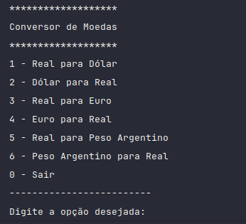
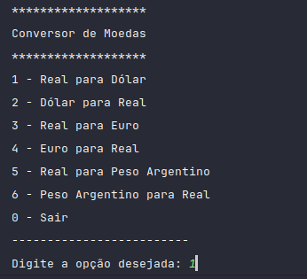
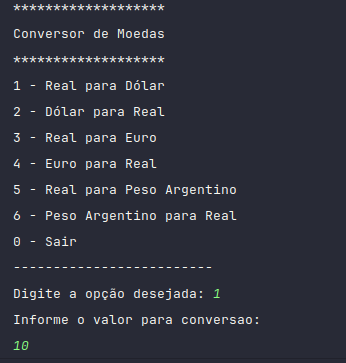
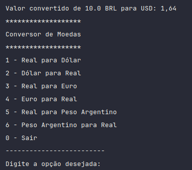

# Conversor de Moedas

Este é um projeto de conversor de moedas simples em Java que utiliza a ExchangeRate-API para obter as taxas de câmbio e realizar conversões entre diferentes moedas. O projeto foi construído para ser fácil de usar e entender, especialmente para programadores iniciantes.

## Funcionalidades

- Converte entre as seguintes moedas:
  - Real (BRL) para Dólar (USD)
  - Dólar (USD) para Real (BRL)
  - Real (BRL) para Euro (EUR)
  - Real (BRL) para Peso Argentino (ARS)
  - Peso Argentino (ARS) para Real (BRL)
  - Dólar (USD) para Peso Argentino (ARS)
  - Peso Argentino (ARS) para Dólar (USD)
- Permite ao usuário inserir o valor a ser convertido.
- Exibe a taxa de conversão e o valor convertido.

## Requisitos

- Java 8 ou superior
- Biblioteca Gson

## Como Configurar o Projeto

1. **Clone o repositório**:

   ```bash
   git clone https://github.com/seu-usuario/conversor-moeda-challenge.git
   cd conversor-de-moedas

## Instruções de uso

**Crie um arquivo api_key.txt**
- Na raiz do projeto, crie um arquivo chamado api_key.txt e insira sua chave da API no conteúdo do arquivo. O arquivo api_key.txt deve conter apenas a chave da API sem aspas.
  - Acesse o [Exchange Rate API](https://www.exchangerate-api.com//) e crie a sua API Key.
- A clsse **Config** irá acessar o arquivo api_key.txt e ler o seu conteúdo para que possa ser substituído na variável API_KEY.
- Execute o projeto. 
  - Ao executar o programa, você verá um menu com as op~oes de conversão. Escolha a opção desejada. Em seguida, insira o valor que deseja converter. O programa deverá exivir o valor convertido.
  1. 
  2. 
  3. 
  4. 
  
  - O programa rodará em loop. Digite a opção 0 para parar o programa. 

**Licença**
Este projeto está licenciado sob a Licença MIT - veja o arquivo [LICENSE](LICENSE) para mais detalhes.

**Autor**
- @rafaelcerqueira
